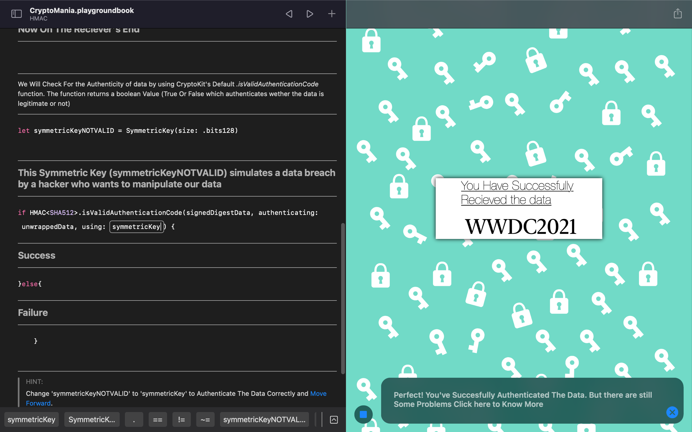
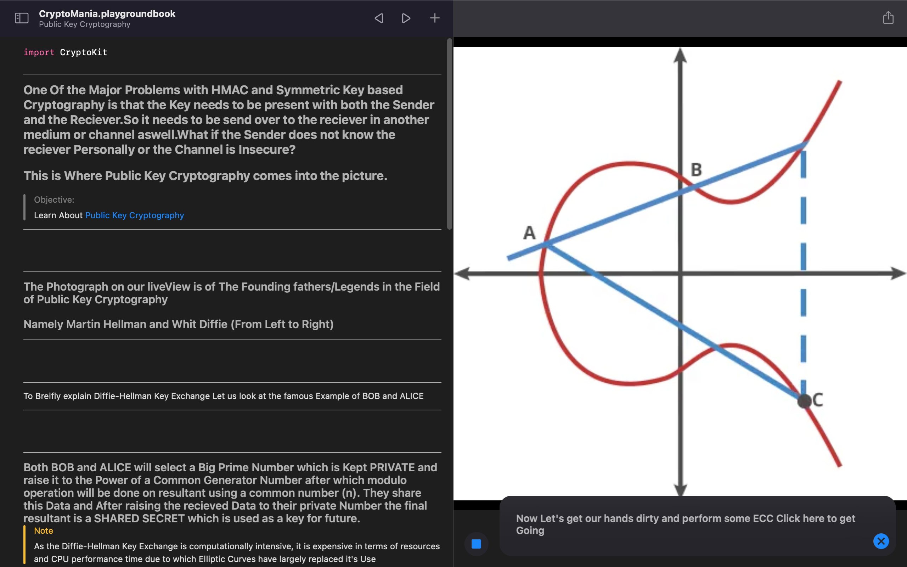
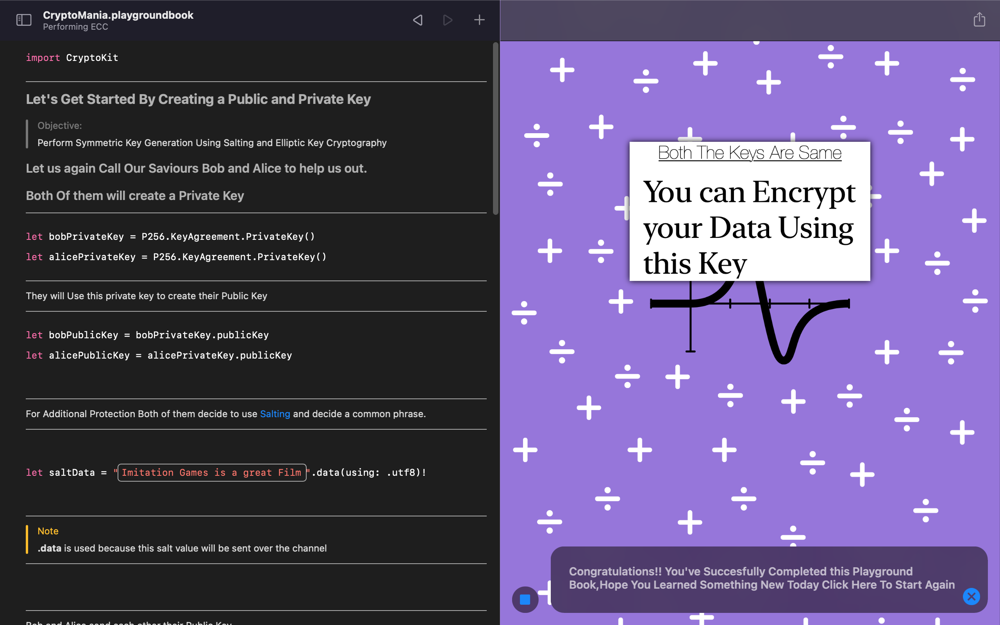
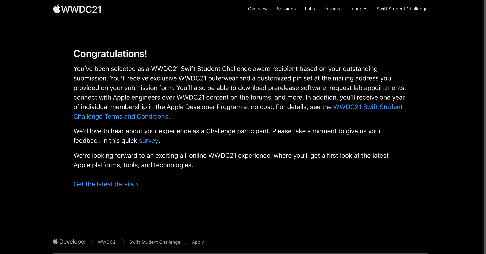

# CryptoMania is A Swift Playground Based on Cryptography and data protection

## I am extremely elated and excited to Announce that My Submission "CryptoKit" got selected for WWDC2021-Swift Student Challenge.

 ||  ||  || 
